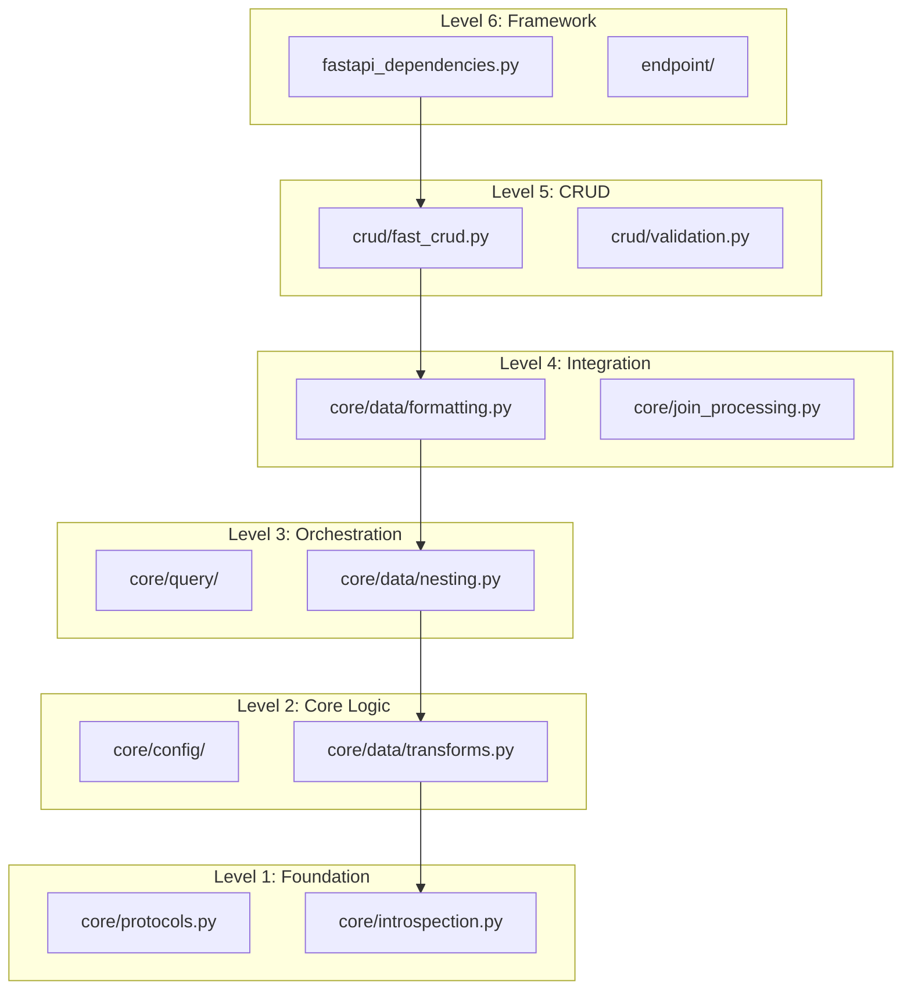

# Contributing to FastCRUD

We're excited that you're interested in contributing to FastCRUD! This guide will help you understand our development process, architectural principles, and how to make meaningful contributions.

## Getting Started

### Prerequisites

Before you begin, make sure you have:

- **Python 3.9+** installed
- **UV** for dependency management ([install UV](https://docs.astral.sh/uv/))
- **Git** for version control
- A **GitHub account** for submitting pull requests

### Setting Up Your Development Environment

1. **Fork and Clone**
   ```sh
   git clone https://github.com/your-username/fastcrud.git
   cd fastcrud
   ```

2. **Install Dependencies**
   ```sh
   uv sync
   ```

3. **Verify Installation**
   ```sh
   uv run pytest --version
   uv run mypy --version
   ```

## Understanding the Architecture

!!! info "Architecture Overview"
    FastCRUD follows a six-level dependency hierarchy designed to prevent circular dependencies and ensure clean separation of concerns. Understanding this architecture is crucial for effective contributions.

### Dependency Levels



### Key Principles

**Protocol-Based Design**: We use Python protocols instead of concrete class dependencies to maintain loose coupling and enable better testing.

**Framework Separation**: All FastAPI-specific code is isolated in dedicated modules, keeping the core business logic framework-agnostic.

**Pure Functions**: Data transformation operations are implemented as pure functions wherever possible, making them easy to test and reason about.

## Making Your First Contribution

### 1. Choose Your Contribution

Good first contributions include:

- **Bug fixes** in existing functionality
- **Documentation improvements** and examples
- **Test coverage** enhancements
- **Small feature additions** that fit the existing patterns

### 2. Plan Your Changes

Before coding:

1. **Read the relevant architecture section** to understand where your changes should go
2. **Check existing patterns** in similar code
3. **Consider the dependency hierarchy** - ensure your changes don't create circular imports
4. **Write tests first** when adding new functionality

### 3. Code Standards

#### Import Organization
```python
# Standard library imports first
from typing import Any, Optional, Union

# Third-party imports
from fastapi import FastAPI
from sqlalchemy import select

# Local imports - respect the dependency hierarchy
from ..core import ModelInspector  # Lower level
from .validation import validate_params  # Same level
```

#### Type Annotations
```python
# Use protocols for interfaces
def process_data(processor: DataProcessor) -> ProcessedResult:
    """Use protocols instead of concrete classes."""
    pass

# Be explicit with return types
async def get_item(db: AsyncSession, item_id: int) -> Optional[Item]:
    """Clear return type annotations."""
    pass
```

#### Function Design
```python
# Pure functions when possible
def transform_data(data: dict[str, Any]) -> dict[str, Any]:
    """No side effects, easy to test."""
    return processed_data

# Clear single responsibility
async def validate_and_create_item(
    db: AsyncSession, 
    item_data: CreateItemSchema
) -> Item:
    """One clear purpose per function."""
    validated_data = validate_item_data(item_data)
    return await create_item(db, validated_data)
```

## Development Workflow

### Running Tests

```sh
# Run all tests
uv run pytest

# Run with coverage
uv run pytest --cov=fastcrud

# Run specific test file
uv run pytest tests/test_crud.py

# Run with verbose output
uv run pytest -v
```

### Code Quality Checks

```sh
# Type checking
uv run mypy fastcrud

# Linting and formatting
uv run ruff check --fix
uv run ruff format

# Run all checks
uv run pytest && uv run mypy fastcrud && uv run ruff check
```

### Testing Your Changes

1. **Unit tests** for individual functions
2. **Integration tests** for component interactions  
3. **End-to-end tests** for complete workflows
4. **Manual testing** with the documentation examples

## Contribution Guidelines

### Pull Request Process

1. **Create a feature branch**
   ```sh
   git checkout -b feature/your-feature-name
   ```

2. **Make your changes** following the architecture principles

3. **Add tests** for new functionality

4. **Update documentation** if needed

5. **Run the full test suite**
   ```sh
   uv run pytest && uv run mypy fastcrud && uv run ruff check
   ```

6. **Submit your pull request** with a clear description

### Pull Request Template

When submitting a PR, include:

- **What** you changed and **why**
- **How** to test your changes
- **Screenshots** for UI changes (if applicable)
- **Breaking changes** (if any)
- **Related issues** (if applicable)

## Common Contribution Scenarios

### Adding a New CRUD Method

1. **Add the method** to `FastCRUD` class in `crud/fast_crud.py`
2. **Add validation** in `crud/validation.py` if needed
3. **Add tests** in `tests/test_crud.py`
4. **Update type hints** and ensure protocol compliance

### Adding a New Filter Operator

1. **Add the operator** in `core/filtering/operators.py`
2. **Update the processor** in `core/filtering/processor.py`
3. **Add validation** in `core/filtering/validators.py`
4. **Add tests** and documentation examples

### Adding Framework Support

1. **Create adapter module** in the framework layer (Level 6)
2. **Keep core logic unchanged** - only add framework-specific bindings
3. **Follow the protocol interfaces** for consistency
4. **Add comprehensive tests** for the new framework

## Getting Help

- **Documentation**: Check our [Architecture](architecture.md) page for detailed design information
- **Discussions**: Use GitHub Discussions for questions
- **Issues**: Create an issue for bugs or feature requests
- **Discord**: Join our community for real-time help

## Recognition

All contributors are recognized in our changelog and contributor list. We appreciate every contribution, no matter how small!

---

Thank you for contributing to FastCRUD! 🚀