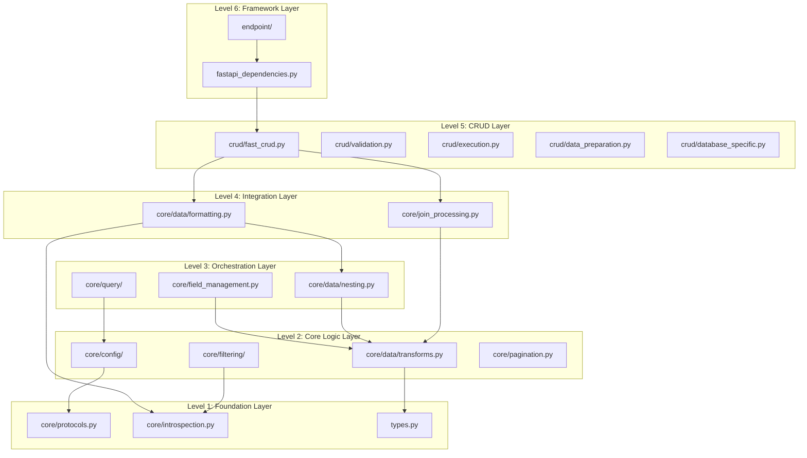

# Understanding FastCRUD

**The architecture, design decisions, and structure that keep your CRUD operations sane.**

You have FastCRUD running. Now you need to understand how it's built and why. This is a technical discussion about the architecture, the tradeoffs we made, and how the pieces fit together.

## Six-Layer Architecture

FastCRUD follows a strict six-level dependency hierarchy because it solves real problems in maintaining and scaling CRUD applications.

```
fastcrud/
├── fastapi_dependencies.py    # Level 6: Framework
├── crud/                      # Level 5: CRUD Operations
├── core/data/formatting.py    # Level 4: Integration
├── core/query/               # Level 3: Orchestration
├── core/data/transforms.py   # Level 2: Core Logic
└── core/protocols.py         # Level 1: Foundation
```

The separation is strict. Framework never imports from CRUD. CRUD never imports from core orchestration. Dependencies flow in one direction: Framework → CRUD → Integration → Orchestration → Core → Foundation.

When debugging, if join operations break, you know it's in the Integration layer. If filter parsing is wrong, start in Orchestration. If data transformation fails, check Core Logic. You don't hunt through the codebase - you know exactly where each piece of logic lives.



### Foundation Layer (Level 1)

The foundation layer contains the building blocks that everything else depends on. Database introspection, type definitions, and the Protocol interfaces that prevent circular dependencies.

```
core/
├── protocols.py        # Protocol definitions for loose coupling
├── introspection.py   # SQLAlchemy model inspection utilities
└── types.py          # Type definitions and aliases
```

**protocols.py** - This is where we break circular dependencies. Instead of importing concrete classes and creating import loops, we define Protocol interfaces:

```python
class CRUDInstance(Protocol):
    model: Any
    async def get_multi_joined(self, db: Any, **kwargs: Any) -> Union[Dict[str, Any], Any]: ...
```

The execution layer can depend on this protocol without knowing about the actual FastCRUD class. Clean separation, no circular imports.

**introspection.py** - Figure out primary keys, relationships, column types - all the stuff you need to build dynamic queries without hardcoding model details.

This foundation is boring by design. It doesn't change often, which means everything built on top stays stable.

### Core Logic Layer (Level 2)

Pure business logic. No database connections, no FastAPI dependencies, no external service calls. Just the rules for how CRUD operations should work.

```
core/
├── config/              # Configuration and settings
├── filtering/           # Filter processing and validation
├── data/transforms.py   # Pure data transformation functions
└── pagination.py       # Pagination logic and utilities
```

**data/transforms.py** - Pure functions that transform data structures. Take a list of join results, reshape them into nested objects. Take query results, format them for API responses. No side effects, easy to test:

```python
def handle_one_to_many(data: List[Dict], nested_key: str) -> List[Dict]:
    """Transform flat join results into nested structures."""
    # Pure function - same input always produces same output
    pass
```

**filtering/** - All the logic for parsing filter expressions like `name__icontains` or `age__gte`. Validation, operator mapping, SQL generation - but no actual database calls. That happens higher up.

**pagination.py** - Offset calculations, limit validation, cursor generation. The math and logic of pagination without any database specifics.

This layer is where the business rules live. How should pagination work? What filter operators make sense? How do you nest joined data? Pure logic, no infrastructure concerns.

### Orchestration Layer (Level 3)

This is where simple operations get combined into complex workflows. Query building, field management, data nesting - operations that coordinate multiple core logic functions.

```
core/
├── query/               # SQL query building and composition
├── field_management.py  # Field selection and projection logic
└── data/nesting.py     # Data nesting with introspection
```

**query/** - Builds SQLAlchemy queries from filter parameters, sort orders, join configurations. Takes the pure logic from filtering and pagination and turns it into actual SQL:

```python
# Takes filter config from core logic
filters = {"name__icontains": "admin", "status": "active"}

# Builds actual SQLAlchemy query
query = select(User).where(
    User.name.ilike("%admin%"),
    User.status == "active"
)
```

**data/nesting.py** - Combines data transformation with model introspection. Knows how to take flat join results and reconstruct the object relationships based on SQLAlchemy model definitions.

This layer knows about SQLAlchemy but not about FastAPI or your specific database setup. It orchestrates operations but doesn't execute them.

### Integration Layer (Level 4)

Where everything comes together. Complex join processing, response formatting, coordinating between different subsystems.

```
core/
├── data/formatting.py    # Response formatting with join processing
└── join_processing.py   # SQL join coordination and execution
```

**join_processing.py** - The complexity of SQL joins made manageable. Handles join condition detection, nested loading, avoiding N+1 queries:

```python
# Automatically detects that User.tier_id == Tier.id
# Builds efficient joins instead of separate queries
users_with_tiers = await get_multi_joined(
    db,
    joins_config=[JoinConfig(model=Tier, join_prefix="tier_")]
)
```

**data/formatting.py** - Takes query results and formats them for API responses. Handles nested data, field selection, type conversion. The bridge between your database results and what your API sends to clients.

This layer knows about your specific use cases but stays framework-agnostic. It could work with FastAPI, Flask, or any other web framework.

### CRUD Layer (Level 5)

The main FastCRUD functionality. This is what you interact with directly - the methods that create, read, update, and delete your data.

```
crud/
├── fast_crud.py          # Main CRUD class and public interface
├── validation.py         # Input validation and sanitization
├── execution.py         # Query execution coordination
├── data_preparation.py   # Data preparation for database operations
└── database_specific.py  # Database-specific optimizations
```

**fast_crud.py** - The public interface. When you call `crud.get_multi()` or `crud.create()`, this is what you're calling. Clean, simple methods that hide the complexity underneath.

**execution.py** - Coordinates the actual database operations. Takes queries from the orchestration layer and executes them. Handles transactions, error recovery, result processing.

**validation.py** - Validates your inputs before they hit the database. Type checking, constraint validation, security checks. Better to catch problems here than in a failed database transaction.

The CRUD layer is opinionated about how CRUD operations should work, but flexible about how you use them.

### Framework Layer (Level 6)

FastAPI-specific code. Dependency injection, endpoint creation, HTTP request/response handling.

```
├── fastapi_dependencies.py  # FastAPI dependency providers
└── endpoint/               # Automatic endpoint generation
```

**fastapi_dependencies.py** - All the FastAPI-specific stuff. Session management, dependency injection, request parsing. Keeps framework concerns separate from business logic.

**endpoint/** - Automatic CRUD endpoint generation. Point it at a model and schema, get full CRUD endpoints with pagination, filtering, and validation.

This layer could be replaced with Flask, Django, or any other framework without touching the layers below. That's the point.

## Design Decisions

### Why Protocol-Based Architecture?

You've probably seen codebases where everything imports everything else. Change one file, break three others. Import errors that make no sense. Circular dependency hell.

We use Python protocols instead of concrete class dependencies:

```python
# Instead of this (creates circular imports)
from ..crud.fast_crud import FastCRUD

def some_function(crud: FastCRUD):
    pass

# We do this (clean, no circular imports)
from ..core.protocols import CRUDInstance

def some_function(crud: CRUDInstance):
    pass
```

Protocols define interfaces without implementation. The execution layer knows what methods a CRUD instance should have, but it doesn't need to import the actual FastCRUD class. Duck typing made explicit.

You can test components in isolation. You can swap implementations without changing dependent code. You can understand one layer without knowing about all the others.

### Why Six Levels Instead of Three?

Most architectures have three layers - presentation, business, data. We have six. Why the complexity?

Because three layers don't stay three layers. Your "business logic" layer grows. Soon you have database queries mixed with validation mixed with data transformation mixed with API formatting. Everything becomes interdependent.

Six levels force separation:

- **Data transformation** (pure functions) stays separate from **validation** (which might hit the database)
- **Query building** stays separate from **query execution**
- **Framework concerns** stay separate from **business logic**

When something breaks, you know which level to check. When you need to change how filtering works, you know it's in the Core Logic layer, not scattered across three giant files.

### Framework Separation Strategy

All FastAPI-specific code lives in Level 6. Everything below that could work with any web framework.

If you need to add a GraphQL endpoint, or build a CLI tool, you don't rewrite your CRUD logic. You just build a new Level 6.

```python
# This works with FastAPI
from fastcrud import crud_router

# This would work with Flask
from fastcrud.flask import crud_blueprint

# This would work with Django
from fastcrud.django import CRUDViewSet
```

(We don't ship Flask or Django adapters yet, but the architecture supports it.)

### Pure Functions Where Possible

Data transformation operations are pure functions:

```python
def handle_one_to_many(data: List[Dict], nested_key: str) -> List[Dict]:
    """No side effects. Same input = same output. Easy to test."""
    pass
```

Pure functions are easier to test, easier to debug, and easier to reason about. When you call this function, you know it won't modify your input data, make database calls, or send emails. It just transforms data.

Not everything can be pure - database operations have side effects by definition. But when we can make something pure, we do.

## Understanding the Data Flow

Let's trace what happens when you call `await crud.get_multi_joined()`. This shows how the layers actually work together:

**Request starts** at Level 5 (CRUD):
```python
# crud/fast_crud.py
async def get_multi_joined(self, db, joins_config=None, **kwargs):
    # Delegates to execution layer for filter handling
    return await handle_joined_filters_delegation(self, db, joins_config, **kwargs)
```

**Execution coordination** at Level 5 (CRUD):
```python
# crud/execution.py
async def handle_joined_filters_delegation(crud_instance, db, joins_config, **kwargs):
    # Uses validation to clean inputs
    validated_params = validate_joined_query_params(joins_config, **kwargs)

    # Delegates to join processing
    return await execute_joined_query(db, crud_instance.model, validated_params)
```

**Join processing** at Level 4 (Integration):
```python
# core/join_processing.py
async def process_joined_query(db, model, params):
    # Uses query building to construct SQL
    query = build_joined_query(model, params.joins, params.filters)

    # Executes query
    result = await db.execute(query)

    # Uses formatting to structure response
    return format_joined_response(result, params.joins)
```

**Query building** at Level 3 (Orchestration):
```python
# core/query/builder.py
def build_joined_query(model, joins, filters):
    # Uses filtering logic to parse conditions
    where_clause = build_filter_conditions(filters)

    # Uses join configuration to build joins
    join_clause = build_join_conditions(model, joins)

    return select(model).where(where_clause).outerjoin(join_clause)
```

**Data formatting** at Level 4 (Integration):
```python
# core/data/formatting.py
def format_joined_response(raw_results, joins_config):
    # Uses pure transformation functions
    nested_data = nest_join_data(raw_results, joins_config)

    # Uses more pure functions
    return transform_to_response_format(nested_data)
```

Each layer has one job. CRUD orchestrates. Execution coordinates. Integration formats. Orchestration builds queries. Core Logic processes data. Foundation provides utilities.

When you need to debug, you know exactly where each operation happens. Query too slow? Check Orchestration. Wrong data format? Check Integration. Validation failing? Check CRUD validation.

!!! tip "The Payoff of Layer Separation"

    When you need to add cursor pagination, you change one function in Core Logic. The CRUD layer doesn't care how pagination works.

    When you need to support MongoDB, you swap out the Orchestration layer. The Core Logic stays the same.

    When you need to add GraphQL endpoints, you build a new Framework layer. Everything below stays unchanged.

    This is why debugging is straightforward. Each layer has clear responsibilities, so failures tell you exactly where to look.

## Protocol Implementation Pattern

Here's how we actually use protocols to avoid circular dependencies:

**Step 1: Define the interface** (Level 1 - Foundation)
```python
# core/protocols.py
class CRUDInstance(Protocol):
    model: Any
    async def get_multi_joined(self, db: Any, **kwargs: Any) -> Union[Dict[str, Any], Any]: ...
```

**Step 2: Use the protocol** (Level 5 - CRUD)
```python
# crud/execution.py
from ..core.protocols import CRUDInstance

async def handle_joined_filters_delegation(crud_instance: CRUDInstance, ...):
    # Type checker knows what methods are available
    # No circular import with actual FastCRUD class
    pass
```

**Step 3: Implement the protocol** (Level 5 - CRUD)
```python
# crud/fast_crud.py
class FastCRUD:
    # Automatically satisfies CRUDInstance protocol
    async def get_multi_joined(self, db, **kwargs):
        # Delegates to execution layer, which uses the protocol
        return await handle_joined_filters_delegation(self, db, **kwargs)
```

This creates a clean dependency flow. Lower levels define interfaces. Higher levels implement them. No circular imports, no runtime dependency resolution, no magic.

## Performance Considerations

Performance isn't about making everything fast - it's about making the right things fast and accepting tradeoffs elsewhere.

**Lazy loading is disabled completely**. SQLAlchemy's lazy loading creates N+1 queries:

```python
# This would create N+1 queries with lazy loading
users = await crud.get_multi(db, limit=100)
for user in users:
    print(user.tier.name)  # Separate query for each user!

# Instead, use explicit joins
users = await crud.get_multi_joined(
    db,
    joins_config=[JoinConfig(model=Tier, join_prefix="tier_")],
    limit=100
)
```

More typing upfront, but predictable query patterns. You always know exactly what SQL gets generated.

**Protocol dispatch is fast**. Python protocols compile to regular method calls. No performance overhead compared to duck typing, but with type safety.

**Query building is cached**. Complex filter parsing gets memoized. Build the same query twice, get the same SQL without re-parsing.

**Data transformation is optimized for the common case**. Simple operations (no joins, basic pagination) take the fast path. Complex operations (multiple joins, nested data) take the comprehensive path.

The pattern is: optimize for the common case, make the complex case possible but not necessarily fast.

## Error Handling Strategy

Errors happen. The question is how gracefully you handle them and how quickly you can debug them.

**Layer-specific exceptions**. Each layer raises exceptions that make sense for that layer:

```python
# Foundation layer - low-level issues
class ModelIntrospectionError(Exception): pass

# Core Logic layer - business rule violations
class InvalidFilterError(Exception): pass

# CRUD layer - operation-specific problems
class JoinConfigurationError(Exception): pass
```

When something fails, the exception type tells you which layer to investigate.

**Fail fast principle**. Validate inputs as early as possible:

```python
# Validate join configuration before building queries
if not joins_config:
    raise ValueError("joins_config cannot be empty")

# Much better than failing deep in SQL generation
```

Better to catch problems in validation than in a failed database transaction.

**Preserve error context**. When re-raising exceptions, preserve the original context:

```python
try:
    result = await complex_operation()
except SQLAlchemyError as e:
    raise CRUDOperationError(f"Failed to execute joined query: {e}") from e
```

You get both the high-level context (what operation failed) and the low-level details (why it failed).

## Testing Strategy

Each layer can be tested in isolation, which makes testing faster and more focused.

**Foundation layer** tests are pure unit tests:
```python
def test_handle_one_to_many():
    input_data = [{"id": 1, "name": "user", "posts": []}]
    result = handle_one_to_many(input_data, "posts")
    assert result == expected_structure
```

**Core Logic layer** tests are still unit tests but might use more complex fixtures:
```python
def test_filter_parsing():
    filters = {"name__icontains": "admin", "age__gte": 18}
    parsed = parse_filters(filters, User)
    assert len(parsed.conditions) == 2
```

**CRUD layer** tests use database fixtures:
```python
async def test_get_multi_joined(db_session, sample_users):
    crud = FastCRUD(User)
    result = await crud.get_multi_joined(
        db_session,
        joins_config=[JoinConfig(model=Tier)]
    )
    assert len(result) == len(sample_users)
```

The layer separation makes it easy to test components without setting up the entire system.

## Migration and Versioning Strategy

FastCRUD's architecture makes it easy to evolve without breaking existing code.

**Protocols enable interface versioning**:
```python
class CRUDInstanceV2(Protocol):
    # Extended interface
    async def get_multi_joined(self, db: Any, **kwargs: Any) -> Union[Dict[str, Any], Any]: ...
    async def get_multi_with_count(self, db: Any, **kwargs: Any) -> Dict[str, Any]: ...
```

Old code keeps working with `CRUDInstance`. New code can use `CRUDInstanceV2`.

**Layer isolation limits change impact**:
- Change query building logic? Only affects Level 3 and above
- Change data transformation? Only affects Level 2 and above
- Change FastAPI integration? Only affects Level 6

**Backward compatibility by design**:
```python
# Old way still works
result = await crud.get_multi(db, name="admin")

# New way adds features
result = await crud.get_multi(
    db,
    name="admin",
    advanced_filters={"created_at__gte": yesterday}
)
```

The architecture doesn't force you to rewrite existing code when new features get added.

## Common Patterns and Idioms

Here are the patterns you'll see throughout FastCRUD:

**Delegation pattern** - Higher levels delegate to lower levels:
```python
# FastCRUD delegates to execution
async def get_multi_joined(self, db, **kwargs):
    return await handle_joined_operations(self, db, **kwargs)
```

**Protocol injection** - Use protocols instead of concrete dependencies:
```python
def process_data(crud: CRUDInstance, processor: DataProcessor):
    # Works with any implementation of these protocols
    pass
```

**Pure function composition** - Build complex operations from simple functions:
```python
def format_response(data):
    return apply_field_selection(
        apply_sorting(
            apply_pagination(data)
        )
    )
```

**Early validation** - Check inputs before doing expensive work:
```python
async def complex_operation(params):
    validate_params(params)  # Fast
    result = await expensive_database_operation(params)  # Slow
    return result
```

These patterns create consistency across the codebase. Once you learn them, you can predict how any part of FastCRUD works.

## Next Steps

Now that you understand the architecture:

1. **Explore the layers** - Pick one layer and trace through how it works
2. **Follow a request** - Use the debugger to step through a complete CRUD operation
3. **Understand the tradeoffs** - Each design decision has pros and cons. What are they?

The architecture exists to solve real problems. It's not perfect, but it's predictable. When something breaks at 3 AM, you'll know exactly where to look.

Ready to contribute? Check out our [contributing guide](CONTRIBUTING.md) for the practical details of working with this architecture.

---

**The architecture serves the code, not the other way around.** Every decision was made to solve real problems we encountered while building CRUD applications. Use what works, understand what doesn't, and help us make it better.
