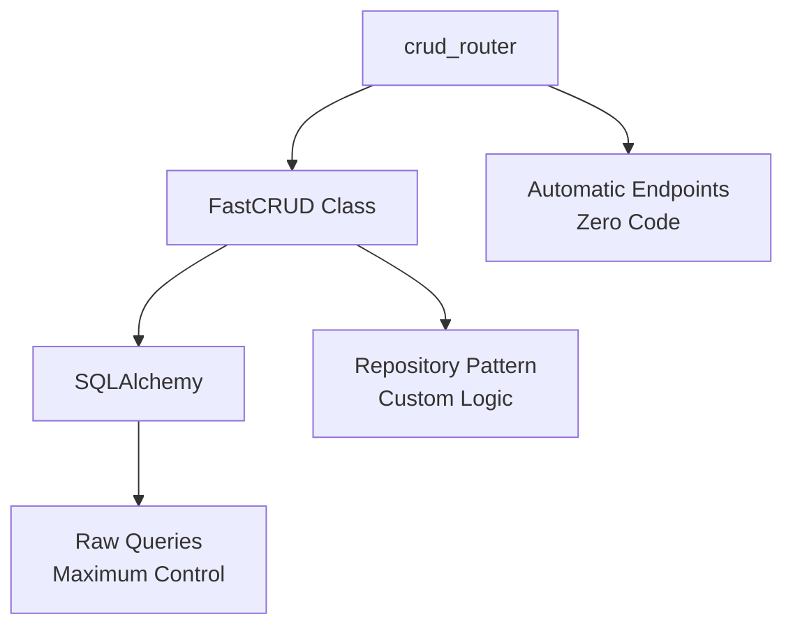
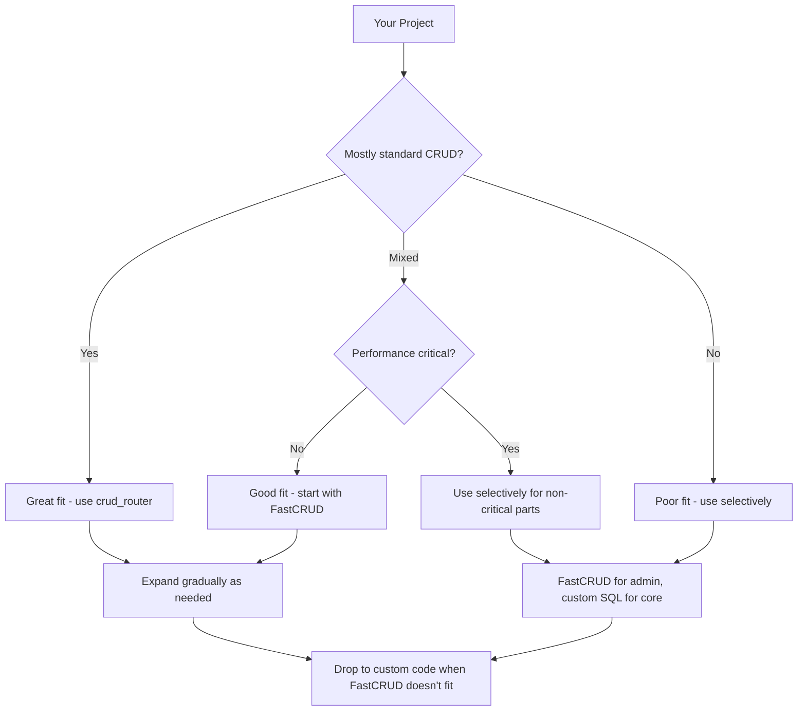

# Why FastCRUD?

**When, how, and why to choose FastCRUD for your FastAPI applications.**

You've found FastCRUD. Maybe you're tired of writing the same CRUD code over and over. Maybe you want a clean repository pattern without the boilerplate. Maybe you're just curious what this library actually does.

This is an honest discussion about the problems FastCRUD solves and when it makes sense for your project.

## The Problems We Actually Face

Building APIs with FastAPI and SQLAlchemy is powerful, but it comes with two distinct pain points that hit different developers at different times:

### Problem 1: The Boilerplate Explosion

Every model needs the same operations. Every endpoint follows the same pattern. Here's what you need to write for get, get_multi, create, update, delete - for each model:

=== "Without FastCRUD"

    ```python
    @app.get("/users")
    async def get_users(
        db: AsyncSession = Depends(get_session),
        skip: int = 0,
        limit: int = 100,
        name: Optional[str] = None,
        email: Optional[str] = None,
        created_after: Optional[datetime] = None,
        sort_by: str = "created_at",
        sort_order: str = "desc"
    ):
        query = select(User)

        # Manual filtering
        if name:
            query = query.where(User.name.ilike(f"%{name}%"))
        if email:
            query = query.where(User.email == email)
        if created_after:
            query = query.where(User.created_at >= created_after)

        # Manual sorting
        if sort_order == "desc":
            query = query.order_by(desc(getattr(User, sort_by)))
        else:
            query = query.order_by(getattr(User, sort_by))

        # Manual pagination
        query = query.offset(skip).limit(limit)

        result = await db.execute(query)
        users = result.scalars().all()

        return [UserResponse.model_validate(user) for user in users]

    @app.post("/users")
    async def create_user():
        # ... another 15-20 lines of manual validation and creation

    @app.get("/users/{user_id}")
    async def get_user():
        # ... another 10-15 lines

    @app.patch("/users/{user_id}")
    async def update_user():
        # ... another 20-25 lines

    @app.delete("/users/{user_id}")
    async def delete_user():
        # ... another 10-15 lines
    ```

=== "With FastCRUD"

    ```python
    user_router = crud_router(
        session=get_session,
        model=User,
        create_schema=CreateUserSchema,
        update_schema=UpdateUserSchema,
        path="/users",
        tags=["Users"]
    )
    app.include_router(user_router)
    ```

The FastCRUD version gives you filtering, sorting, pagination, and all CRUD operations automatically. Not everyone needs automatic endpoints, though.

### Problem 2: The Repository Pattern Overhead

Maybe you don't want automatic endpoints. Maybe you have complex business logic. You still need a clean way to access your data without writing the same queries repeatedly.

Traditional repository pattern means writing interfaces and implementations for every model:

=== "Traditional Repository"

    ```python
    # The interface
    class IUserRepository(ABC):
        @abstractmethod
        async def get_by_email(self, email: str) -> Optional[User]: ...

        @abstractmethod
        async def get_active_users(self, limit: int) -> List[User]: ...

        @abstractmethod
        async def search_users(self, name: str) -> List[User]: ...

    # The implementation
    class UserRepository(IUserRepository):
        def __init__(self, db: AsyncSession):
            self.db = db

        async def get_by_email(self, email: str) -> Optional[User]:
            result = await self.db.execute(select(User).where(User.email == email))
            return result.scalar_one_or_none()

        async def get_active_users(self, limit: int) -> List[User]:
            result = await self.db.execute(
                select(User).where(User.is_active == True).limit(limit)
            )
            return result.scalars().all()

        async def search_users(self, name: str) -> List[User]:
            result = await self.db.execute(
                select(User).where(User.name.ilike(f"%{name}%"))
            )
            return result.scalars().all()
    ```

=== "FastCRUD Repository"

    ```python
    # You automatically get get_multi, get, create, update, delete, etc.
    crud_users = FastCRUD(User)
    ```

FastCRUD gives you a pre-built repository with advanced features like filtering operators (`name__icontains`), joins, and pagination. You focus on domain-specific methods, not query construction.

## What FastCRUD Actually Gives You

Beyond eliminating boilerplate, FastCRUD gives you features you don't even know you'll need - thoroughly tested and maintained. Here are three that take a lot of time and effort to keep reimplementing and maintaining across different codebases:

**Advanced filtering with 20+ operators**. Instead of writing manual `WHERE` clauses for every search field, you get Django-style filtering that works across relationships:

```python
users = await user_crud.get_multi(
    db,
    created_at__gte=last_week,        # Greater than or equal
    tier__name__in=["pro", "enterprise"],  # Joined model filtering
    email__icontains="@company.com",  # Case-insensitive search
    is_active=True                    # Simple equality
)
```

**Automatic joins with proper nesting**. No more writing complex join logic or dealing with flat, denormalized results. FastCRUD detects relationships and gives you properly nested objects:

```python
users = await user_crud.get_multi_joined(
    db,
    joins_config=[
        JoinConfig(model=Profile, join_prefix="profile_"),
        JoinConfig(model=Order, join_prefix="orders_", relationship_type="one-to-many")
    ],
    nest_joins=True
)
# Returns: [{"id": 1, "name": "John", "profile": {...}, "orders": [{...}, {...}]}]
```

**Cursor-based pagination for large datasets**. Offset pagination falls apart after page 1000 - it gets slower and slower. Cursor pagination stays fast regardless of dataset size, which is crucial for infinite scroll interfaces:

```python
result = await user_crud.get_multi_by_cursor(
    db,
    cursor=last_seen_id,
    limit=50,
    sort_columns=["created_at"]
)
```

These features come with built-in optimizations - no N+1 queries, protection against SQL injection, and performance that stays consistent even with large datasets.

Most teams start with `crud_router` for basic models - users, products, categories - to get automatic endpoints quickly. As the application grows, they replace specific endpoints with custom business logic while keeping the standard operations automated.

A typical e-commerce API might use FastCRUD for product catalog management and user administration, but write custom SQLAlchemy for complex inventory calculations or recommendation algorithms. The accounting system uses automatic CRUD for managing vendors and invoices, but implements custom logic for financial reporting and tax calculations.

This mixed approach works because you're not forced to choose one pattern for everything. FastCRUD handles the repetitive database access while you focus on the domain-specific complexity that actually matters for your business.

## How FastCRUD Actually Works

FastCRUD gives you three levels of abstraction that work together:



You can use any combination. Most projects end up using all three for different scenarios.

| Scenario | Use This | Why |
|----------|----------|-----|
| **Admin panels, internal tools** | `crud_router` | Need full CRUD quickly, minimal customization |
| **Standard API endpoints** | `crud_router` | Consistent patterns, automatic documentation |
| **Custom business logic** | `FastCRUD` class | Need validation, workflows, but want advanced features |
| **Complex domain operations** | `FastCRUD` + custom code | Mix repository pattern with specialized queries |
| **Performance-critical queries** | Raw SQLAlchemy | Hand-optimized for specific requirements |
| **Complex aggregations** | Raw SQLAlchemy | Reporting queries that don't fit CRUD patterns |

Most applications use a mix. `crud_router` for simple models, `FastCRUD` class for business logic, raw SQLAlchemy for complex queries.

## When FastCRUD Isn't the Right Tool

Not every project is a good fit for FastCRUD. Adding it comes with real trade-offs. The Django-style filtering syntax (`__gt`, `__in`, `__between`) is different from raw SQLAlchemy - your team needs time to learn it. There's an abstraction layer between your code and the database, which usually doesn't matter for performance but adds complexity when debugging query issues. You're also adding a dependency with its own update cycle.

But most teams find these trade-offs acceptable for the productivity gains, especially since you can always drop down to raw SQLAlchemy when you need complete control. The key is thinking through your specific situation systematically:



**Start small and expand gradually.** Pick a simple model - users, products, categories - and implement it with `crud_router`. See how it feels. Check the generated OpenAPI docs. Run some queries and see if performance is acceptable.

**Think like an engineer.** Even if your application seems like a poor fit overall, FastCRUD might help with parts of it. That analytics platform still needs user management. The performance-critical trading system probably has configuration tables. Use the right tool for each specific problem.

### Project Fit Analysis

Different project types benefit differently from FastCRUD. Here's what we've seen work well and what doesn't:

| Project Type | FastCRUD Fit | Why |
|-------------|-------------|-----|
| **Modular monoliths** | Excellent | Consistent patterns across modules, shared infrastructure |
| **Admin dashboards** | Excellent | Standard CRUD with filtering, minimal custom logic |
| **REST APIs** | Very good | Consistent endpoints, pagination, OpenAPI docs |
| **Microservices** | Very good | Each service has focused CRUD operations |
| **Analytics platforms** | Mixed | Good for user/config management, poor for reporting queries |
| **Workflow engines** | Poor | State transitions, complex business rules |
| **High-frequency trading** | Poor | Hand-optimized queries, microsecond performance |

Most applications fall somewhere in the middle. You have standard user management, product catalogs, order processing alongside specialized business logic. FastCRUD handles the standard parts while you write custom code for the complex domain-specific operations.

!!! note "When to rethink FastCRUD"

    **Analytics Applications** - Complex aggregations don't fit CRUD patterns, but user/config management does

    **Performance-Critical Systems** - Core queries need optimization, but admin interfaces can use FastCRUD

    **Explicit-Everything Teams** - May prefer custom code, but can use FastCRUD for rapid prototyping

    **Domain-Driven Design** - Complex aggregates need custom code, but simple entities work fine

    **Non-CRUD APIs** - Main workflows don't benefit, but supporting data operations do

Even in these scenarios, FastCRUD might still help with parts of your application. That analytics platform still needs user management. The performance-critical trading system probably has configuration tables. Think like an engineer - use the right tool for each specific problem, not an all-or-nothing approach.

## Growing With Your Project

You don't have to architect everything perfectly from day one. FastCRUD lets you start simple and evolve your approach as requirements become clearer.

### Start Simple: Get It Working

When you're building an MVP or just getting started, use `crud_router` for everything. Your entire API becomes a few lines of code:

```python
# Three files get you a complete API
# models.py - Your SQLAlchemy models
# schemas.py - Your Pydantic schemas  
# main.py - Everything else

user_router = crud_router(session=get_session, model=User, ...)
product_router = crud_router(session=get_session, model=Product, ...)
order_router = crud_router(session=get_session, model=Order, ...)

app.include_router(user_router)
app.include_router(product_router)
app.include_router(order_router)
```

This gets you automatic CRUD endpoints, filtering, pagination, and OpenAPI documentation. Great for validating your idea quickly.

### Add Business Logic When You Need It

As your application grows, business requirements emerge that don't fit standard CRUD patterns. Maybe order creation needs inventory validation and confirmation emails. Instead of replacing everything, you just add custom endpoints while keeping the automatic ones:

```python
@app.post("/orders/")
async def create_order(order_data: OrderCreateSchema, db: AsyncSession = Depends(get_session)):
    order_crud = FastCRUD(Order)

    # Custom business logic
    if not await validate_inventory(order_data.items):
        raise HTTPException(400, "Insufficient inventory")

    # Still use FastCRUD for reliable database operations
    order = await order_crud.create(db, order_data)

    # More custom logic
    await send_order_confirmation(order)
    
    return order
```

Your simple endpoints like user management keep working unchanged. You only customize what needs custom behavior.

### Extract Services for Complex Logic

When your custom endpoints start getting complicated, move the business logic to service classes. FastCRUD stays as your data access layer:

```python
class OrderService:
    def __init__(self):
        self.order_crud = FastCRUD(Order)
        self.inventory_service = InventoryService()

    async def create_order(self, db: AsyncSession, order_data: OrderCreateSchema):
        await self.inventory_service.reserve_items(order_data.items)
        order = await self.order_crud.create(db, order_data)
        await self.send_confirmation_email(order)
        return order

# Your endpoints stay clean
@app.post("/orders/")
async def create_order(order_data: OrderCreateSchema, db: AsyncSession = Depends(get_session)):
    service = OrderService()
    return await service.create_order(db, order_data)
```

This gives you clean separation - business logic in services, data access through FastCRUD, HTTP handling in endpoints.

### Add Domain Repositories for Complex Queries

For sophisticated domains, wrap FastCRUD in repositories that expose domain-specific operations:

```python
class UserRepository:
    def __init__(self):
        self.crud = FastCRUD(User)

    async def find_enterprise_admins(self, db: AsyncSession) -> List[User]:
        return await self.crud.get_multi_joined(
            db,
            joins_config=[JoinConfig(model=Company, join_prefix="company_")],
            role="admin",
            company__tier="enterprise"
        )
```

Each step builds naturally on the previous one. You start with automatic endpoints, add custom logic where needed, organize complex behavior into services, and create domain-specific interfaces for sophisticated queries. You never throw away working code - you just add layers when they provide value.

---

Ready to see it in action? 

<div style="text-align: center; margin-top: 30px;">
    <a href="usage/overview/" class="md-button md-button--primary">
        Get Started with FastCRUD →
    </a>
</div>